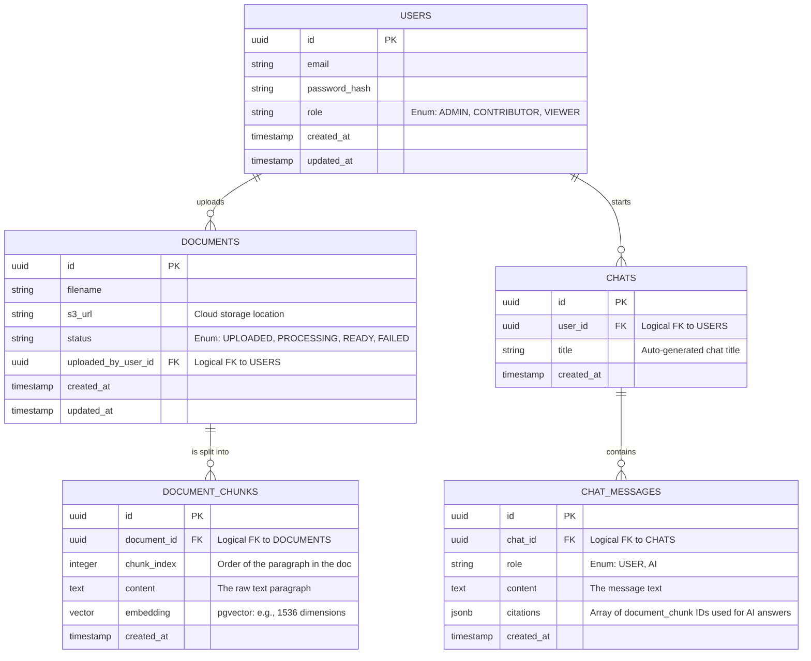

# Entity Relationship Diagram (ERD) & Schema

## 1. Relational Overview
This diagram illustrates the core PostgreSQL database schema for Phase 1 of the Enterprise AI Knowledge Hub.

## 2. Table Details & Rationale

### USERS
- **Purpose:** Handles authentication and role-based access control (RBAC).
- **Design Choice:** We store a `password_hash` (using BCrypt), not plain-text passwords. The `role` column dictates what the user can do.

### DOCUMENTS
- **Purpose:** Tracks the metadata of an uploaded file.
- **Design Choice:** We do NOT store the physical PDF file in the database (that causes massive bloat). We store the PDF on a file system or cloud bucket (like AWS S3) and save the `s3_url` string in this table. 
- **Status Tracking:** The `status` column is crucial for asynchronous processing, allowing the UI to show a "Processing..." spinner.

### DOCUMENT_CHUNKS
- **Purpose:** Supports the AI / RAG pipeline.
- **Design Choice:** We use the `pgvector` PostgreSQL extension for the `embedding` column. This allows us to perform high-speed cosine similarity searches directly in SQL (e.g., `SELECT * FROM document_chunks ORDER BY embedding <=> '[user_query_vector]' LIMIT 5;`).

### CHATS & CHAT_MESSAGES
- **Purpose:** Persists conversational history.
- **Design Choice:** Separating Chats from Chat Messages (One-to-Many relationship) allows a single user to have multiple different chat threads, exactly like the ChatGPT interface. The `citations` column in messages stores a JSON array of chunk IDs so the UI can display "Source: Company Handbook, page 2" next to the AI's answer.
