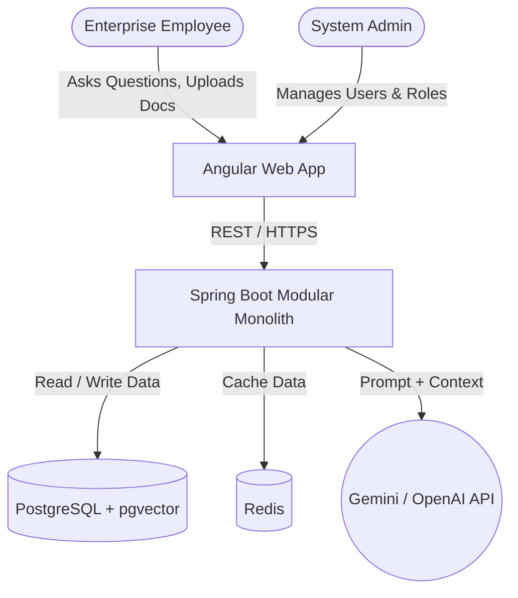
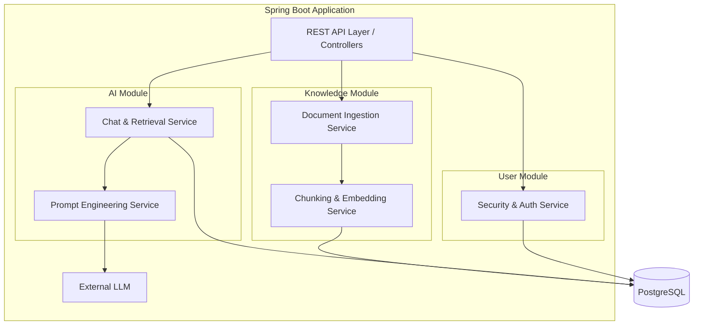

# High-Level Design (HLD)

## 1. System Context Diagram
This diagram shows the entire Enterprise AI Knowledge Hub from a bird's-eye view, illustrating how the users and external systems interact with our platform.

## 2. Component Diagram (The Modular Monolith)
In Phase 1, we are using a **Modular Monolith** architecture. All code is running inside a single Spring Boot application, but it is strictly divided into logical domains.

## 3. Data Flow: Document Ingestion (RAG Pipeline)
How a document becomes searchable knowledge.

1. **Upload:** User uploads a PDF via the frontend.
2. **Text Extraction:** The `Document Ingestion Service` reads the PDF and extracts plain text.
3. **Chunking:** The text is split into smaller, overlapping chunks (e.g., 500 tokens each) so we don't overwhelm the AI's context window.
4. **Embedding:** We call an embedding model (via LangChain4j) to turn each text chunk into a vector (an array of numbers).
5. **Storage:** The chunks and their vectors are saved to PostgreSQL using the `pgvector` extension.

## 4. Data Flow: Conversational Question Answering
How the AI answers questions based on internal documents.

1. **Question:** User asks "What is our remote work policy?"
2. **Vectorize Question:** The `Chat Service` converts the user's question into a vector using the same embedding model.
3. **Similarity Search:** We run a vector similarity search in `pgvector` to find the top 5 document chunks most mathematically similar to the question.
4. **Prompt Building:** The `Prompt Service` builds a strict prompt: *"Answer the user's question using ONLY the following context: [Top 5 chunks]. If the answer is not in the context, say 'I don't know'."*
5. **LLM Call:** The prompt is sent to the Gemini/OpenAI API.
6. **Response:** The LLM's response (along with citations to the chunks used) is returned to the user.
